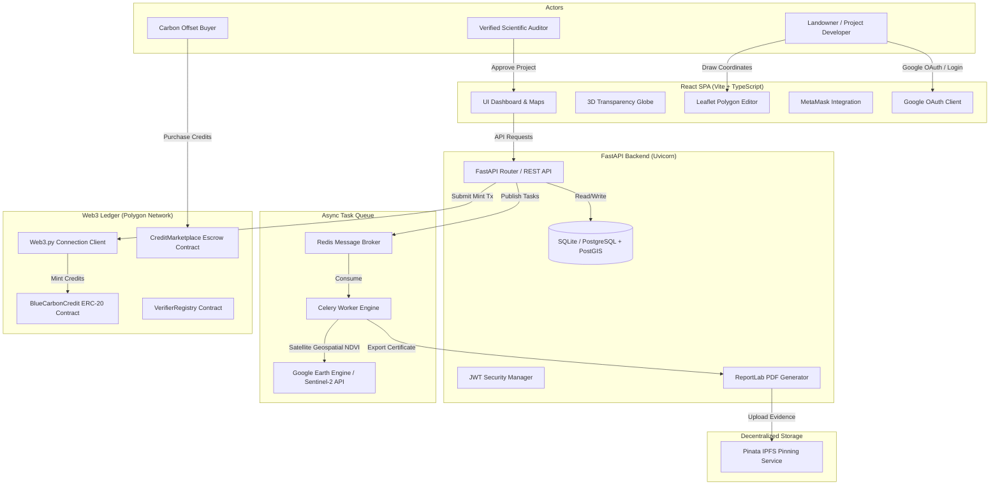
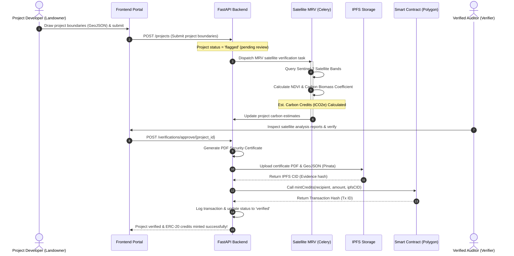

# 🌊 Blockchain-Based Blue Carbon Registry & MRV Portal

A production-grade, decentralized registry and Measurement, Reporting, and Verification (MRV) platform designed to authenticate, issue, and trade blue carbon offsets from coastal wetlands (mangroves, seagrass meadows, and salt marshes) securely on the Polygon ledger.

---

## 🏗️ System Architecture



---

## 🔄 End-to-End Registration & Minting Workflow



---

## 🌟 Key Features

1. **Google OAuth & Metamask Wallet Auth**: Secure account creation and social login integrated alongside Web3 wallet binding for signing transactions.
2. **Dynamic 3D Transparency Globe**: Rotation rendering of the globe using `react-globe.gl` + `three.js`. Active project beacons map size and color intensity proportionally to verified carbon credits.
3. **Interactive Spatial Editor**: Leaflet map integrated with Esri High-Resolution Satellite imagery. Allows project developers to draw boundary polygons and captures coordinate lists instantly.
4. **Automated Satellite MRV Engine**: Background satellite processing simulating Sentinel-2 NDVI time-series trends over drawn boundaries. Estimates biomass and CO2 equivalent storage using regional ecosystem coefficients.
5. **AI-Assisted Anomaly & Degradation Checker**: Background worker checking growth rates against baseline metrics. Triggers alerts and flags projects for manual review if vegetation health decreases.
6. **Multi-Contract Ledger Architecture**: Solidity smart contracts:
   * `BlueCarbonCredit.sol`: ERC-20 token tracking mints, double-issuance protections, and burning retirements.
   * `VerifierRegistry.sol`: Whitelisting registry of verified scientists.
   * `CreditMarketplace.sol`: Native-currency Escrow contract supporting secondary sales.
7. **Decentralized Evidence & Certificates**: PDF certificates dynamically generated using ReportLab, containing verification signatures, IPFS CIDs, and blockchain transaction hashes.

---

## 📂 Project Directory Structure

```text
├── smart-contract/            # Hardhat Project
│   ├── contracts/             # Solidity Smart Contracts
│   ├── scripts/               # Deploy Script
│   └── test/                  # Contract Unit Tests
│
├── backend/                   # FastAPI Backend
│   ├── app/
│   │   ├── routers/           # API routes (Auth, Projects, Verifications, Marketplace)
│   │   ├── models.py          # SQLAlchemy SQLite/PostgreSQL Models
│   │   ├── schemas.py         # Pydantic schemas
│   │   ├── database.py        # DB session configs
│   │   ├── mrv.py             # Geospatial and NDVI formulas
│   │   ├── blockchain.py      # Web3.py smart contract interfaces
│   │   ├── ipfs.py            # Pinata IPFS file pinning client
│   │   ├── tasks.py           # Celery automated monitoring workers
│   │   └── pdf_gen.py         # PDF Certificate generator
│   └── requirements.txt
│
└── frontend/                  # Vite + React (TypeScript) SPA Dashboard
    ├── src/
    │   ├── components/        # Layout, LeafletMap, and 3D Globe
    │   ├── pages/             # Dashboard, Submit, Details, Verifier Queue, Marketplace, Transparency
    │   └── utils/             # Axios API config
    ├── package.json
    └── index.html
```

---

## 🔑 Environment Variables Setup (`.env`)

To run this application locally or in production, you must set up a `.env` file in the **root directory**. 

> [!WARNING]
> Never upload your `.env` file containing private keys, API secrets, or passwords to public repositories. Make sure `.env` is ignored by git (already pre-configured in `.gitignore`).

Create a file named `.env` in the root folder and add the following:

```env
# General
PROJECT_NAME="Blue Carbon Registry & MRV System"

# Database Configuration
DATABASE_URL=sqlite:///./blue_carbon.db

# JWT Authentication Secret
JWT_SECRET=YOUR_SUPER_SECRET_JWT_KEY_HERE

# Redis Broker (Celery Background Tasks)
REDIS_URL=redis://localhost:6379/0

# Blockchain JSON-RPC Provider (Alchemy/Infura Polygon Testnet)
RPC_URL=https://polygon-amoy.g.alchemy.com/v2/YOUR_ALCHEMY_API_KEY

# Smart Contract Minter / Admin Private Key (Hardhat Account #0 or testnet dev wallet)
ADMIN_PRIVATE_KEY=YOUR_ADMIN_PRIVATE_KEY_HERE

# IPFS Pinning Provider (Pinata API keys)
PINATA_API_KEY=YOUR_PINATA_API_KEY
PINATA_API_SECRET=YOUR_PINATA_API_SECRET

# MRV Mode (Set to False to query real Sentinel-2 satellite data via Earth Engine)
MOCK_MODE=True

# Google OAuth Credentials
GOOGLE_CLIENT_ID=YOUR_GOOGLE_CLIENT_ID.apps.googleusercontent.com
VITE_GOOGLE_CLIENT_ID=YOUR_GOOGLE_CLIENT_ID.apps.googleusercontent.com
```

---

## 🚀 Running the System

### Option A: One-Command Docker Setup (Recommended)
Make sure you have Docker and Docker Compose installed, then run:
```bash
docker-compose up --build
```
This builds and starts:
* PostgreSQL + PostGIS database on `5432`
* Redis (Celery broker) on `6379`
* Hardhat node simulator on `8545`
* Contract deployer (automatically compiles and deploys Solidity contracts, then exports address metadata to the frontend and backend)
* FastAPI backend API on `8000`
* Celery background worker task runner
* React Vite frontend portal on `5173`

---

### Option B: Manual Step-by-Step Setup

#### 1. Start & Deploy Smart Contracts
```bash
cd smart-contract
npm install
# Start local simulated blockchain node
npx hardhat node
# In a separate terminal window, compile & deploy contracts to the local node
npx hardhat run scripts/deploy.js --network localhost
```

#### 2. Run FastAPI Backend
Ensure a python virtual environment is configured:
```bash
cd backend
python -m venv venv
.\venv\Scripts\activate # Windows
# Or: source venv/bin/activate # Mac/Linux

pip install -r requirements.txt
# Start the API server
uvicorn app.main:app --reload --port 8000
```

#### 3. Run React Frontend
```bash
cd frontend
npm install --legacy-peer-deps
npm run dev
```
Open `http://localhost:5173` in your browser.

---

## 🔑 Seeding / Demo Logins
The system automatically creates these test accounts on database creation:

| Role | Username | Password | Default Hardhat Address |
| :--- | :--- | :--- | :--- |
| **Landowner** | `owner@registry.org` | `ownerpass` | `0x3C44CdDdB6a900fa2b585dd299e03d12FA4293BC` (Account #2) |
| **Verifier** | `verifier@registry.org` | `verifierpass` | `0x70997970C51812dc3A010C7d01b50e0d17dc79C8` (Account #1) |
| **Admin** | `admin@registry.org` | `adminpass` | `0xf39Fd6e51aad88F6F4ce6aB8827279cffFb92266` (Account #0) |

*Clicking "Connect Wallet" on the nav header will dynamically detect MetaMask or auto-inject the correct Hardhat test wallet matching your logged-in role.*
